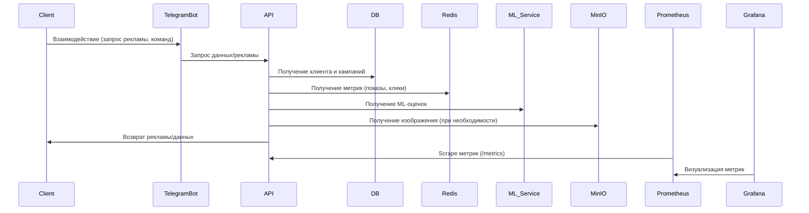
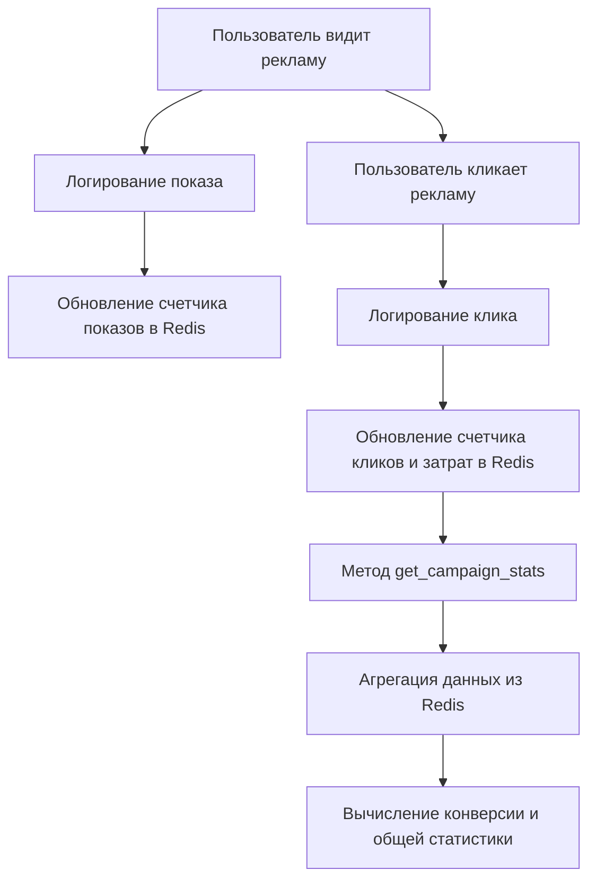
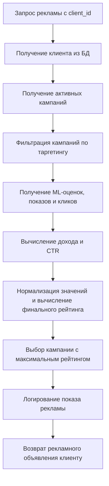

# Проект: Система управления рекламными кампаниями

## Описание

Это проект по созданию системы для управления рекламными кампаниями. Система позволяет рекламодателям создавать, отслеживать и управлять кампаниями, а пользователи могут получать рекламу, основанную на их характеристиках (например, возраст, местоположение, пол).

### Технологии

- **PostgreSQL** — реляционная база данных для хранения данных о пользователях, рекламных кампаниях и рекламодателях.
- **Redis** — для кеширования данных и управления сессиями.
- **MinIO** — объектное хранилище для медиафайлов, таких как изображения.
- **Prometheus** — для сбора метрик и мониторинга системы.
- **Grafana** — для визуализации данных и мониторинга.
- **Docker** и **Docker Compose** — для контейнеризации и развертывания приложения.
- **SQLite** - база данных для тестирования

---

## Запуск приложения

### 1. Клонируйте репозиторий
### 2. Перейдите в директорию папки solution
```bash
cd ваша директория
```
### 3. Скачайте необходимые библиотеки при помощи команды
```bash
pip install -r requirements.txt
```
### 4. Чтобы запустить тесты пропишите в консоль
```bash
pytest
```
### 5. Запустите Docker и поднимите контейнеры этой командой
```bash
docker compose up -d
```
## Сервисы будут доступны по следующим адресам:
#### Веб-приложение: http://localhost:8080
#### Grafana: http://localhost:3000
```bash
login: admin
password: 20071357
```
#### Telegram bot
```bash
@ad_engine_bot
```
## Внешние зависимости
1. PostgreSQL
- Для хранения данных о пользователях, кампаниях и рекламодателях используется PostgreSQL, так как она поддерживает транзакции, индексы и ACID-совместимость.

2. Redis
- Для кеширования данных и повышения скорости работы системы используется Redis. Это позволяет эффективно обрабатывать часто запрашиваемые данные, такие как сессии пользователей или статистику кампаний.

3. MinIO
- Для хранения изображений рекламных кампаний используется MinIO, объектное хранилище, совместимое с Amazon S3 API.

4. Prometheus и Grafana
- Для мониторинга и визуализации данных системы используются Prometheus и Grafana. Prometheus собирает метрики с сервисов, а Grafana отображает их на интерактивных панелях мониторинга.

5. Docker и Docker Compose
- Docker используется для контейнеризации сервисов, что позволяет развернуть приложение на любой платформе. Docker Compose помогает управлять многими сервисами, такими как база данных, кеш, веб-приложение и другие, с помощью единого конфигурационного файла
6. Почему для тестирования используется SQLite вместо PostgreSQL
- **Легковесность и простота настройки:** SQLite не требует отдельного сервера и сложной конфигурации, что упрощает локальное тестирование.
- **Быстрое создание тестовой базы данных:** SQLite позволяет создавать и удалять базу данных на лету, что удобно для автоматизированных тестов.
- **Изоляция тестовой среды:** Использование SQLite помогает обеспечить независимость тестов от внешних сервисов, таких как PostgreSQL, снижая вероятность ошибок, связанных с настройками сервера.
- **Ускорение тестирования:** За счет отсутствия сетевого взаимодействия SQLite работает быстрее в тестовой среде, позволяя сократить время выполнения тестов.
- Важно отметить, что несмотря на удобство SQLite для тестирования, на продакшене используется PostgreSQL, так как он обеспечивает высокую надежность, масштабируемость и богатый набор функций для работы с данными.
---
# Демонстрация работы приложения

В этом разделе показаны основные сценарии использования приложения, логика работы бота и метода показа рекламы с помощью блок-схем и диаграмм.

## Основные сценарии использования

### API для клиентов
- **Получение данных клиента:**  
  `GET /clients/{clientId}`

- **Массовое обновление/создание клиентов:**  
  `POST /clients/bulk`

### API для рекламодателей
- **Получение информации о рекламодателе:**  
  `GET /advertisers/{advertiserId}`

- **Массовое обновление/создание рекламодателей:**  
  `POST /advertisers/bulk`

### API для рекламных кампаний
- **Создание кампании с модерацией:**  
  `POST /advertisers/{advertiserId}/campaigns`

- **Получение списка кампаний:**  
  `GET /advertisers/{advertiserId}/campaigns`

- **Получение деталей, обновление и удаление кампании:**  
  `GET/PUT/DELETE /advertisers/{advertiserId}/campaigns/{campaignId}`

### API для ML оценок
- **Обновление и добавление оценки рекламной кампании:**  
  `POST /ml-scores`

### API показа рекламы и работы с изображениями
- **Показ рекламы:**  
  `GET /ads`

- **Загрузка/обновление/удаление/получение изображений рекламы:**  
  `POST /ads/{ad_id}/upload-image`,  
  `PUT /ads/{ad_id}/update-image`,  
  `DELETE /ads/{ad_id}/delete-image`,  
  `GET /ads/{ad_id}/image`

- **Запись кликов:**  
  `POST /ads/{ad_id}/click`
  
### Получение статистики кампании

- **Общий сбор статистики по кампании:**  
  `GET /stats/campaigns/{campaignId}`  
  Возвращает агрегированные данные (показы, клики, затраты, конверсия) для конкретной кампании.

- **Получение ежедневной статистики кампании:**  
  `GET /stats/campaigns/{campaignId}/daily`  
  Возвращает список статистических данных по каждому дню с начала кампании до дня окончания или текущего дня.

### Получение статистики рекламодателя

- **Общая статистика по всем кампаниям рекламодателя:**  
  `GET /stats/advertisers/{advertiserId}/campaigns`  
  Возвращает агрегированные данные по всем кампаниям конкретного рекламодателя.

- **Ежедневная статистика по всем кампаниям рекламодателя:**  
  `GET /stats/advertisers/{advertiserId}/campaigns/daily`  
  Возвращает список ежедневных статистических данных по всем кампаниям рекламодателя до текущего дня.

### Управление временем

- **Изменение текущего дня:**  
  `POST /time/advance`  
  Позволяет задать новую дату для симуляции прохождения времени, что используется для тестирования динамики кампаний.
### Модерация
- **Переключатель модерации:**  
  `POST /moderation/toggle`  
  Включает и выключает модерацию.
### Генерация рекламного текста
- **Генератор текста:**  
`POST /generate_ad_text`  
Генерирует текст рекламной компании по названию компании рекламодателя и описанию рекламы.
### Симуляция кликов и показов для grafana
- **Симулятор:**  
`POST /simulation/control`
Для вашего удобства сделан эндпоинт накрутка статистики для наглядности графаны.
### Для подробного просмотра и тестирования эндпоинтов, вы можете перейти по ссылке **http://localhost:8080/docs**
## Диаграмма взаимодействия компонентов:

# Как работает статистика

Приложение собирает и агрегирует данные по рекламным кампаниям и рекламодателям. Основные метрики, которые рассчитываются:
- **Количество показов (impressions_count):** Количество уникальных клиентов, которым показывалась реклама.
- **Количество кликов (clicks_count):** Количество уникальных кликов по рекламе.
- **Затраты (spent_impressions, spent_clicks, spent_total):** Суммарные затраты, начисляемые за показы и клики.
- **Конверсия (conversion):** Отношение кликов к показам, выраженное в процентах.

Для ежедневной статистики данные агрегируются по дням (от начала кампании до текущего или конечного дня кампании). Если за день имеются клики, но показов не зафиксировано, все показатели считаются равными нулю.

Также существует возможность изменения "текущего дня" с помощью API для тестирования временной динамики кампаний.
### Алгоритм сбора и агрегации статистики
Приложение использует Redis для хранения счетчиков:

При показе рекламы вызывается метод log_impression, который:
- Регистрирует уникальные показы для кампании.
- Обновляет ежедневные счетчики и суммирует затраты за показы.
---
При клике вызывается метод log_click, который:
- Проверяет, был ли клик уже зафиксирован.
- Регистрирует уникальные клики и обновляет ежедневные счетчики и затраты за клики.
---
Методы get_campaign_stats и get_campaign_daily_stats собирают данные из Redis, суммируя и вычисляя конверсию. Аналогичные методы используются для агрегации статистики по всем кампаниям рекламодателя.
## Диаграмма агрегации статистики

# Алгоритм выбора рекламной кампании и таргетинг

В этом разделе описаны формулы, используемые для расчёта рейтинга кампаний, а также логика таргетинга для определения соответствия кампании клиенту.

## Формулы алгоритма

Алгоритм выбора рекламной кампании и таргетинг работает следующим образом:

### Расчёт основных метрик для каждой кампании:

- ML-значение (ml_value):
Это значение, полученное из ML-оценки кампании. Если оценка отсутствует, оно считается равным 0.

- CTR (Click-Through Rate):
Если количество показов (imp_count) больше нуля, то CTR рассчитывается как отношение количества кликов (click_count) к количеству показов:
`ctr = click_count / imp_count`
Если показов нет, CTR равен 0.

- Новый доход (new_income):
Рассчитывается по формуле:
`new_income = ml_value * cost_per_click + cost_per_impression`

### Нормализация метрик:

После вычисления new_income и CTR для всех кандидатов определяются максимальные значения:

- max_income — максимальное значение new_income среди всех кампаний.
- max_ctr — максимальное значение CTR среди всех кампаний.
Нормализованные значения рассчитываются следующим образом:

`normalized_income = new_income / max_income`
`normalized_ctr = ctr / max_ctr`
### Итоговый рейтинг кампании:

Итоговый рейтинг (candidate_score) рассчитывается как взвешенная сумма нормализованных показателей:

`candidate_score = 0.8 * normalized_income + 0.2 * normalized_ctr`

При этом выбирается кампания с наивысшим значением candidate_score, но только если количество показов этой кампании (impressions_count + 1) меньше 1.05 * impressions_limit. (количество показов не превышает лимит показов более чем на 5 процентов).

Таким образом, алгоритм сочетает ML-оценку, показатели эффективности (CTR), стоимости за клик и показ, а также ограничение по количеству показов, чтобы выбрать наиболее релевантную кампанию для клиента.

---

## Логика таргетинга

Функция `campaign_matches_client(targeting, client)` определяет, подходит ли кампания конкретному клиенту. Алгоритм проверки выглядит следующим образом:

1. **Отсутствие таргетинга:**  
   Если объект таргетинга равен `None`, кампания подходит для всех клиентов.

2. **Пол (gender):**  
   - Если в таргетинге задано значение `gender`, то оно сравнивается с полом клиента.
   - Если значение не совпадает и не установлено как `'ALL'`, кампания не подходит.

3. **Возраст (age_from и age_to):**  
   - Если указан `age_from`, то возраст клиента должен быть не меньше этого значения.
   - Если указан `age_to`, то возраст клиента должен быть не больше этого значения.

4. **Местоположение (location):**  
   - Если указано местоположение, то оно должно совпадать с местоположением клиента.

Если все условия выполняются, функция возвращает `True`, что означает, что кампания подходит для клиента.

---

## Пример таргетинга

Предположим, таргетинг кампании имеет следующие параметры:
- **gender:** "FEMALE"
- **age_from:** 25
- **age_to:** 40
- **location:** "Москва"

Клиент, для которого подбирается кампания, должен удовлетворять следующим условиям:
- Пол клиента должен быть "FEMALE" (или таргетинг может быть равен "ALL").
- Возраст клиента должен быть от 25 до 40 лет.
- Местоположение клиента должно быть "Москва".

Если хотя бы одно из этих условий не выполнено, кампания не будет считаться подходящей.

---

Таким образом, алгоритм сочетает ML-оценку, стоимость за клик и показ, а также таргетинг, чтобы выбрать наиболее релевантную рекламную кампанию для конкретного клиента.

Ниже представлена блок-схема работы метода показа рекламы:


---
# Работа с изображениями
В данном разделе описывается, как приложение обрабатывает действия с изображениями для рекламных кампаний, включая загрузку, обновление, удаление и получение изображений.
## Загрузка изображения

При загрузке изображения выполняется проверка формата файла (поддерживаются JPEG и PNG). Если изображение уже было загружено, возвращается существующий URL, иначе файл сохраняется в MinIO, а в базе данных обновляется ссылка на изображение.
## Обновление изображения
Если изображение уже существует, оно удаляется из хранилища, и затем загружается новое изображение. URL изображения обновляется в записи кампании.
## Удаление изображения
При удалении изображения из MinIO ссылка на изображение очищается в записи кампании. Если изображение не установлено, возвращается ошибка.
## Получение изображения
Эндпоинт возвращает изображение рекламного объявления в виде потокового ответа (StreamingResponse). Для этого извлекается URL изображения, определяется его тип по расширению, и происходит обращение к MinIO для получения объекта.
## Функции работы с MinIO
### Сохранение изображения
Функция `save_image_file`:
- Проверяет наличие и создает бакет, если его нет.
- Генерирует уникальное имя объекта.
- Загружает изображение в MinIO и возвращает публичный URL.
### Удаление изображения
- Функция `delete_image_file` удаляет изображение из MinIO по его публичному URL.
- Сначала извлекается имя бакета и объекта, затем выполняется удаление через клиент MinIO.
# Модерация

В этом разделе описывается, как работает модерация рекламных текстов в приложении, и приведены примеры кода, демонстрирующие её реализацию.

## Переключатель режима модерации

Модерация может быть включена или выключена с помощью специального эндпоинта. При включении режим проверки текстов активируется, и все рекламные тексты проходят модерацию перед сохранением или публикацией.

## Функция модерации текста
Функция `moderate_text` использует модель LLM (`gpt-4o-mini`) для анализа входного текста на наличие нежелательного контента.

## Проверка включения режима модерации
Функция `should_moderate` возвращает булево значение, определяя, включена ли модерация. Значение хранится в Redis (ключ "moderation_enabled").

## Интеграция модерации в бизнес-логику
- Обновление рекламной кампании
При обновлении кампании модерация проверяет новый рекламный текст и заголовок. Если хотя бы один из них не проходит модерацию, возвращается ошибка.
- Создание рекламной кампании
При создании новой кампании текст объявления и заголовок также проходят модерацию.
 - Генерация рекламного текста
При генерации рекламного текста с помощью LLM, сгенерированный контент проходит модерацию перед возвратом пользователю.

# Генерация рекламного текста

Процесс генерации рекламного текста включает несколько шагов, позволяющих создать креативный и лаконичный текст с использованием LLM (`gpt-4o-mini`) и проверки модерацией. Ниже описана логика работы эндпоинта, отвечающего за генерацию текста.

## Этапы генерации текста

1. **Проверка модерации:**  
   Если режим модерации включен, входные данные (название объявления и название рекламодателя) проходят проверку через функцию `moderate_text`. Если один из параметров не проходит модерацию (флаг `flagged` равен `true`), API возвращает ошибку.

2. **Получение API-ключа:**  
   Перед обращением к LLM проверяется наличие переменной `OPENAI_API_KEY`. Если ключ не задан, генерируется ошибка.

3. **Формирование запроса:**  
   Составляется текстовый prompt, содержащий инструкцию для LLM. В prompt включены:
   - Название объявления.
   - Название рекламодателя.
   - Дополнительное описание требований к тексту (емкость, инновационность, мотивация к действию, ограничение по количеству токенов).

4. **Вызов LLM:**  
   Создаётся асинхронный клиент `AsyncOpenAI` с использованием API-ключа, и отправляется запрос на генерацию текста. В запросе указываются:
   - Модель (`gpt-4o-mini`).
   - Сообщения: системное сообщение (роли копирайтера) и пользовательское сообщение с prompt.
   - Параметры генерации: температура (0.7) и максимальное количество токенов (150).

5. **Обработка ответа:**  
   Ответ от LLM анализируется, из него извлекается сгенерированный текст, который затем очищается от лишних символов (например, кавычек и пробелов).

6. **Возврат результата:**  
   Очищенный текст возвращается клиенту в формате `AdTextResponse`.
   
# Логика работы бота

Этот документ описывает архитектуру и логику работы Telegram-бота, который предоставляет пользователям доступ к функциональности системы управления рекламными кампаниями, включая управление кампаниями, статистикой, изображениями, модерацией и генерацией рекламного текста.

---

## 1. Главное меню и навигация

При запуске (команда `/start`) бот отправляет пользователю главное меню с кнопками, такими как:
- **Кампании**
- **Статистика**
- **Изображения**
- **Модерация**
- **Генерация рекламного текста**

Каждая кнопка содержит callback-данные, позволяющие определить выбранный раздел. При нажатии бот редактирует сообщение, заменяя его содержимым соответствующего раздела, и предоставляет набор inline-кнопок для дальнейших действий.

---

## 2. Использование состояний (FSM)

Бот использует механизм конечного автомата (FSM) для последовательного сбора информации от пользователя. Например, при генерации рекламного текста:
- **Сбор данных для генерации:**  
  Бот сначала запрашивает заголовок объявления, переводя пользователя в состояние `waiting_for_ad_title`. После получения заголовка бот запрашивает название рекламодателя, обновляя данные в контексте. Когда все данные собраны, бот отправляет запрос к API для генерации рекламного текста и выводит результат.

- **Обработка данных для создания или обновления кампании:**  
  При создании или обновлении кампании бот последовательно запрашивает у пользователя необходимые данные (например, ID рекламодателя, заголовок, текст, даты, лимиты, параметры таргетинга). Ввод проверяется на корректность (например, формат UUID или числовые значения), и после сбора всех данных бот отправляет соответствующий API-запрос.

---

## 3. Интерактивное управление разделами

### Кампании

- **Создание кампании:**  
  Пользователь вводит ID рекламодателя, затем заголовок, текст объявления, даты, лимиты и параметры таргетинга. Бот проводит валидацию и отправляет запрос на создание кампании. Таргетинг можно быстро пропускать одной кнопкой, если ввод не нужен (в обновлении компании тоже работает).
  
- **Получение, обновление и удаление кампании:**  
  Для получения кампании, обновления или удаления бот запрашивает необходимые ID и отправляет соответствующие API-запросы, возвращая результат пользователю.

### Изображения

- **Загрузка изображения:**  
  Бот запрашивает у пользователя ID рекламного объявления и фотографию. После получения фото бот загружает изображение через API и возвращает URL.
  
- **Обновление и удаление:**  
  Аналогичным образом бот обрабатывает обновление и удаление изображения, отправляя запросы к API.
  
- **Получение изображения:**  
  По запросу бот извлекает изображение с сервера и отправляет его пользователю.

### Модерация

- **Переключение режима модерации:**  
  Пользователь может включить или выключить режим модерации через специальное меню. Бот отправляет запрос на изменение статуса модерации, после чего уведомляет пользователя.

### Генерация рекламного текста

- **Сбор данных для генерации:**  
  Бот запрашивает у пользователя заголовок и название рекламодателя, после чего отправляет запрос к API для генерации рекламного текста.
  
- **Модерация сгенерированного текста:**  
  Если режим модерации включён, сгенерированный текст и заголовок проходят проверку через LLM-модель модерации. В случае отклонения пользователь получает сообщение об ошибке.
  
- **Возврат результата:**  
  После успешной генерации бот выводит сгенерированный рекламный текст пользователю.

### Статистика

- **Получение статистики:**  
  Пользователь может запросить общую или дневную статистику кампании или рекламодателя, введя соответствующий ID. Бот отправляет запрос к API, получает агрегированные данные и выводит их в текстовом формате.

---

## 4. Обработка callback-запросов и возврат в главное меню

Во всех разделах предусмотрена возможность возврата в главное меню через кнопку «Главное меню» с callback-данными "back_main". Это позволяет пользователю легко переключаться между разделами без необходимости повторного ввода команды `/start`.

---

## Пример работы

При получении команды `/start` бот отправляет главное меню. Если пользователь нажимает на кнопку **Генерация реклам. текста**, бот:
1. Запрашивает заголовок объявления.
2. После ввода заголовка запрашивает название рекламодателя.
3. Когда оба параметра собраны, бот отправляет API-запрос на генерацию текста.
4. Полученный текст выводится пользователю, либо, в случае ошибки (например, если сгенерированный текст не прошёл модерацию), бот уведомляет пользователя об ошибке.

Таким образом, бот обеспечивает интуитивно понятное, пошаговое взаимодействие с пользователем, позволяя управлять рекламными кампаниями, изображениями, статистикой и другими функциями системы.

# Визуализация статистики

В данном разделе описывается, как приложение собирает, симулирует и визуализирует статистические данные с помощью Prometheus и Grafana.

## Основные компоненты

- **Prometheus:** Сервис, который регулярно запрашивает (scrape) метрики с нашего приложения через эндпоинт `/metrics` и сохраняет их в базе временных рядов.
- **Grafana:** Инструмент визуализации, который использует данные, собранные Prometheus, для построения графиков, панелей и дашбордов.
- **Симуляция статистики:** Фоновая задача, которая каждые секунду обновляет метрики (например, показы, клики, доходы), имитируя реальное поведение рекламных кампаний.

---

## Механизм работы

### 1. Управление симуляцией статистики

Эндпоинт `/simulation/control` позволяет включать и выключать симуляцию статистики. При включении создается фоновая задача, которая каждую секунду обновляет метрики для заранее определённого набора кампаний.
### 2. Симуляция и обновление метрик
Функция simulate_day_and_metrics имитирует обновление метрик для заданных кампаний. Каждую секунду она:

- Генерирует случайное число показов, кликов и рассчитывает доходы.
- Обновляет метрики, используя счетчики и гейджи Prometheus:
- ad_impressions_total – счетчик показов.
- ad_clicks_total – счетчик кликов.
- ad_impression_revenue – гейдж для дохода от показов.
- ad_click_revenue – гейдж для дохода от кликов.
### 3. Экспорт метрик Prometheus
Эндпоинт /metrics предоставляет метрики в формате, совместимом с Prometheus. Этот эндпоинт вызывается Prometheus для сбора актуальных данных.
### 4. Визуализация в Grafana
Перейдите по ссылке http://localhost:3000 и введите логин и пароль
```bash
login: admin
password: 20071357
```
Вы увидите дашборд со всей статистикой.
### Описание каждого правила (recording rules)
- Все метрики связанные с временем рассчитываются по минутам, так как мы используем в проекте не реальное время, для наглядности я поставил минуты. В продакшане можно будет заменить на реальные дни. 
- ad_engine:ctr_percentage
Вычисляет CTR (Click-Through Rate) в процентах. Рассчитывается как отношение общего количества кликов к общему количеству показов, умноженное на 100.

- ad_engine:total_revenue
Суммирует доходы от показов и кликов для всех кампаний, используя функцию sum. Позволяет получить общий доход.

- ad_engine:revenue_from_clicks
Суммирует доходы, полученные от кликов. Это агрегированное значение по всем кампаниям.

- ad_engine:revenue_from_impressions
Суммирует доходы, полученные от показов рекламы. Используется агрегатная функция sum для вычисления общего дохода от показов.

- ad_engine:minute_revenue_from_clicks
Вычисляет прирост дохода от кликов за последнюю минуту, используя функцию increase для метрики ad_click_revenue.

- ad_engine:minute_revenue_from_impressions
Вычисляет прирост дохода от показов за последнюю минуту, используя функцию increase для метрики ad_impression_revenue.

- ad_engine:minute_total_revenue
Вычисляет суммарный ежеминутный доход, объединяя приросты от кликов и показов. Это позволяет отследить, как изменяется доход в режиме реального времени.

- ad_engine:trend_revenue
Рассчитывает тренд дохода по времени как суммарный прирост дохода (от показов и кликов) за последнюю минуту. Позволяет увидеть динамику изменения дохода.

- ad_engine:clicks_per_minute
Вычисляет общее количество кликов, произошедших за последнюю минуту, используя функцию increase для метрики ad_clicks_total.

- ad_engine:impressions_per_minute
Вычисляет общее количество показов, произошедших за последнюю минуту, используя функцию increase для метрики ad_impressions_total.

- ad_engine:api_errors_per_minute
Подсчитывает количество ошибок API, зафиксированных за последнюю минуту, используя функцию increase для метрики api_errors_total.

---

# Структура данных

В данном разделе описана структура базы данных с таблицами и их атрибутами.

---

## Advertiser

Таблица для хранения информации о рекламодателе.

| Атрибут       | Тип данных | Описание                   |
|---------------|------------|----------------------------|
| advertiser_id | UUID       | Уникальный идентификатор   |
| name          | String     | Название рекламодателя     |

---

## Campaign

Таблица для хранения информации о рекламных кампаниях.

| Атрибут             | Тип данных | Описание                                          |
|---------------------|------------|---------------------------------------------------|
| campaign_id         | UUID       | Уникальный идентификатор кампании                 |
| advertiser_id       | UUID       | Идентификатор рекламодателя                       |
| impressions_limit   | Integer    | Лимит показов                                     |
| clicks_limit        | Integer    | Лимит кликов                                      |
| cost_per_impression | Numeric    | Стоимость за показ                                |
| cost_per_click      | Numeric    | Стоимость за клик                                 |
| ad_title            | String     | Заголовок рекламы                                 |
| ad_text             | String     | Текст рекламы                                     |
| start_date          | Integer    | Дата начала кампании                              |
| end_date            | Integer    | Дата окончания кампании                           |
| targeting           | JSON       | Параметры таргетинга                              |
| image_url           | String     | Ссылка на изображение для кампании                |

---

## MLScore

Таблица для хранения результатов оценки рекламных кампаний для пользователей.

| Атрибут       | Тип данных | Описание                                      |
|---------------|------------|-----------------------------------------------|
| client_id     | UUID       | Идентификатор клиента                         |
| advertiser_id | UUID       | Идентификатор рекламодателя                   |
| score         | Integer    | Оценка эффективности рекламной кампании       |

---

## User

Таблица для хранения информации о пользователях.

| Атрибут   | Тип данных | Описание                      |
|-----------|------------|-------------------------------|
| client_id | UUID       | Уникальный идентификатор клиента |
| login     | String     | Логин пользователя            |
| age       | Integer    | Возраст пользователя          |
| location  | String     | Местоположение пользователя   |
| gender    | String     | Пол пользователя              |


